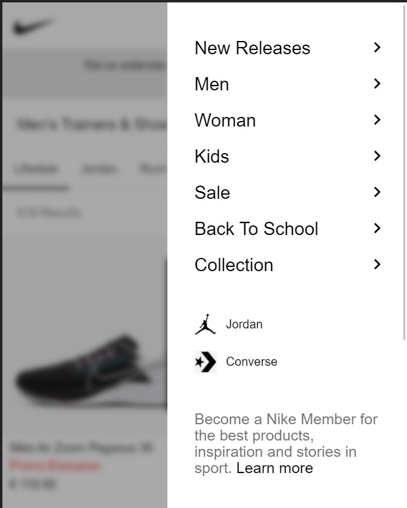
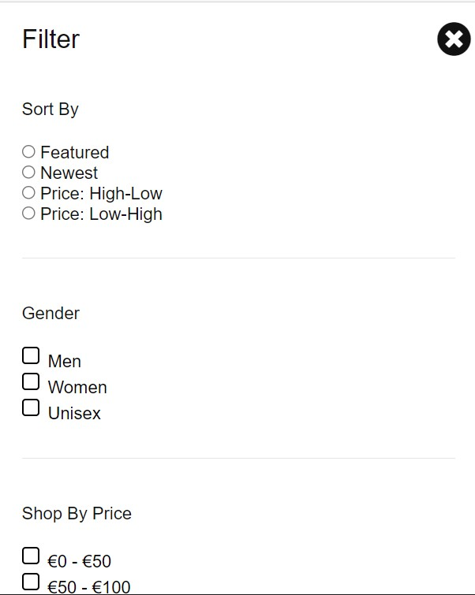

# Procesverslag
Markdown is een simpele manier om HTML te schrijven.  
Markdown cheat cheet: [Hulp bij het schrijven van Markdown](https://github.com/adam-p/markdown-here/wiki/Markdown-Cheatsheet).

Nb. De standaardstructuur en de spartaanse opmaak van de README.md zijn helemaal prima. Het gaat om de inhoud van je procesverslag. Besteedt de tijd voor pracht en praal aan je website.

Nb. Door *open* toe te voegen aan een *details* element kun je deze standaard open zetten. Fijn om dat steeds voor de relevante stuk(ken) te doen.

## Jij

uitwerken voor kick-off werkgroep

### Auteur:
Ymaro Blue

#### Je startniveau:
Zwart

#### Je focus:
Responsive
 

## Je website

uitwerken voor kick-off werkgroep

### Je opdracht:
https://www.nike.com/nl/en/w/shoes-y7ok

### Verbetringen die ik wil toepassen
 #### Overzicht Pagina 
 - Header en footer goed namaken en responsive
 - Pagina responsive
 - filters scrollend aan de bovenkant toevoegen(mobiel)
 - Meer filters werkend maken
 - (search toevoegen?)*
 
 #### Detail Pagina
 - scrollende banner info
 - Add to bag micro interactie bij het scrollen
 - Als favoriet markeren
 - (reviews en reviews schrijven ?)*
 
 *Met genoeg tijd
 
#### Screenshot(s) van de eerste pagina (small screen): 
##### Overzicht schoenen pagina
 
 

#### Screenshot(s) van de tweede pagina (small screen):
##### Schoen Detail Pagina <Enter>
 
 

 

## Breakdownschets (week 1)

uitwerken na afloop 2e werkgroep

## Html verbeteringen
 
### article 
 

### filter opties kleur
 

### Footer
 

## Voortgang 1 (week 2)

uitwerken voor 1e voortgang

### Stand van zaken
Eigenlijk is alles wat ik wilde doen tot nu toe goed gegaan. Dus geen problemen
 
Het aanpassen van de header/nav is nu responsive en ook echt overgenomen ipv een kleine versie van de desktop.
|  |  |

 
En datzelfde geldt voor de footer, maar die is nog niet helemaal klaar, maar hij is wel responsive.
|  |  |

### Agenda voor meeting
samen met je groepje opstellen

| student 1      | student 2          | student 3    | student 4        |
| ---            | ---                | ---          | ---              |
| dit bespreken  | en dit             | en ik dit    | en dan ik dat    |
| en dat ook nog | dit als er tijd is | nog een punt | dit wil ik zeker |
| ...            | ...                | ...          | ...              |

### Verslag van meeting
hier na afloop snel de uitkomsten van de meeting vastleggen

- punt 1
- punt 2
- nog een punt
- ...

## Voortgang 2 (week 3)

uitwerken voor 2e voortgang

### Stand van zaken
Het maken van de mobile menu inclusief logica bij het uitklappen en laten sliden van de zijkant ging wel goed. 
Dit heb ik ook toegepast voor de filter menu alleen komt deze van de onderkant ipv de zijkant.

| Mobile menu     | Filter menu          |
| ---            | ---                |
|   |              |

### Agenda voor meeting
samen met je groepje opstellen

| student 1      |
| ---            |
| Wanneer kan je beter grid gebruiken dan flex  |
| Beste manier om grid te gebruiken in een layout |
| ...            |

### Verslag van meeting
hier na afloop snel de uitkomsten van de meeting vastleggen

- punt 1
- punt 2
- nog een punt
- ...

## Toegankelijkheidstest (week 4)

uitwerken na test in 8e voortgang

### Bevindingen
Lijst met je bevindingen die in de test naar voren kwamen:

#### Titel eerste bevinding
Hier korte omschrijving (met indien nodig een afbeelding)

Hier een omschrijving van hoe het opgelost kan worden (met indien nodig een afbeelding)

#### Titel tweede bevinding. 
Hier korte omschrijving (met indien nodig een afbeelding)

Hier een omschrijving van hoe het opgelost kan worden (met indien nodig een afbeelding)

#### Titel volgende bevinding. 
Hier korte omschrijving (met indien nodig een afbeelding)

Hier een omschrijving van hoe het opgelost kan worden (met indien nodig een afbeelding)

#### Titel nog een bevinding. 
Hier korte omschrijving (met indien nodig een afbeelding)

Hier een omschrijving van hoe het opgelost kan worden (met indien nodig een afbeelding)

## Voortgang 3 (week 4)

uitwerken voor 3e voortgang

### Stand van zaken
hier dit ging goed & dit was lastig (neem ook screenshots op van delen van je website en code)

### Agenda voor meeting
samen met je groepje opstellen

| student 1      | student 2          | student 3    | student 4        |
| ---            | ---                | ---          | ---              |
| dit bespreken  | en dit             | en ik dit    | en dan ik dat    |
| en dat ook nog | dit als er tijd is | nog een punt | dit wil ik zeker |
| ...            | ...                | ...          | ...              |

### Verslag van meeting
hier na afloop snel de uitkomsten van de meeting vastleggen

- punt 1
- punt 2
- nog een punt
- ...

## Eindgesprek (week 5)

uitwerken voor eindgesprek

### Stand van zaken
hier dit ging goed & dit was lastig (neem ook screenshots op van delen van je website en code)

### Screenshot(s)

hier screenshot(s) van je eindresultaat

## Bronnenlijst

continu bijhouden terwijl je werkt

Nb. Wees specifiek ('css-tricks' als bron is bijv. niet specifiek genoeg).

1. bron 1
2. bron 2
3. ...

